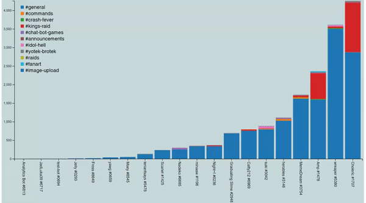
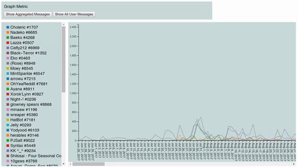
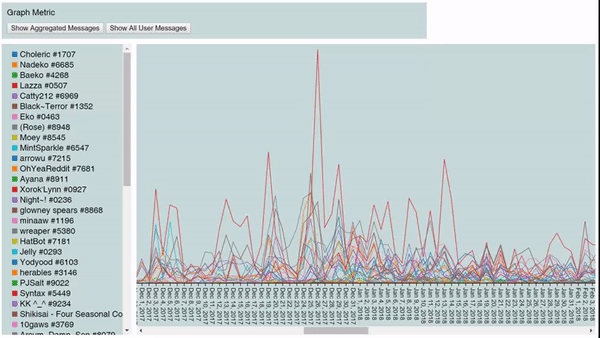

# discord-analytics
[Discord](https://discordapp.com/) bot that pulls server message history & info, writes to a database & presents visualizations on a basic site.

The bot uses [Discord.js](https://discord.js.org/#/) with [Node](https://nodejs.org/en/) in order to call the Discord API, writing messages to a [Postgres](https://www.postgresql.org/) database. The backend is routed with [Express](https://www.express.com/), and the graphs are made using [D3.js](https://d3js.org/). The site is some basic HTML, CSS, and [jQuery](https://jquery.com/).

**NOTE: THIS PROJECT IS A WIP** - some fine-tuning is still needed before the whole system can be deployed to the public.

## Structure
* `/node` contains various Node-based files for running the bot and inserting into Postgres.
* `/postgres` holds table definitions & stored queries to manipulate the data as necessary for visualizations.
* `/web` includes everything pertinent to the actual site.

## Dependencies
Various Node modules at the time of writing:
* [Discord.js](https://www.npmjs.com/package/discord.js) 11.4.2
* [Express](https://www.npmjs.com/package/express) 4.16.3
* [pg](https://www.npmjs.com/package/pg) 7.4.3
* [require-sql](https://www.npmjs.com/package/require-sql) 1.0.0

# Site Screenshots
Bar graph of users, with their message activity split by channel:

Line graph of users, with their message activity graphed over time:

## Addendum
If you want to set up your own copy of this bot from the source, it will be tricky - but here are the steps.
* Ensure you have PostgreSQL, Node, & all the relevant dependencies installed
* Create & associate an app to your Discord account [here](https://discordapp.com/developers/applications)
* Update `authTEMPLATE.json` with the relevant credentials and rename it to just `auth.json`
* Invite your app to a server: `https://discordapp.com/oauth2/authorize?client_id=YOUR_BOTS_CLIENT_ID&scope=bot&permissions=347136`
* Give it any necessary permissions to view locked channels, if you want those included in the data pull
* cd to the `node/` directory and start the bot & web server: `node index.js`
* Type `!pull` in any of the server's channels to trigger the datapull: the Node app will give constant updates. The pull might take a while with larger servers (200k+ messages)
* Open `web/index.html`
